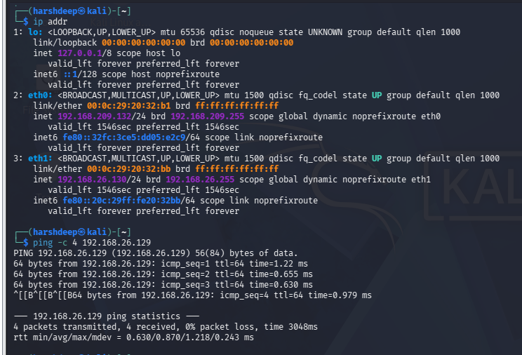
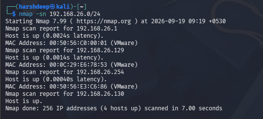
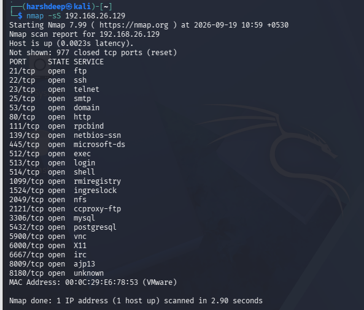
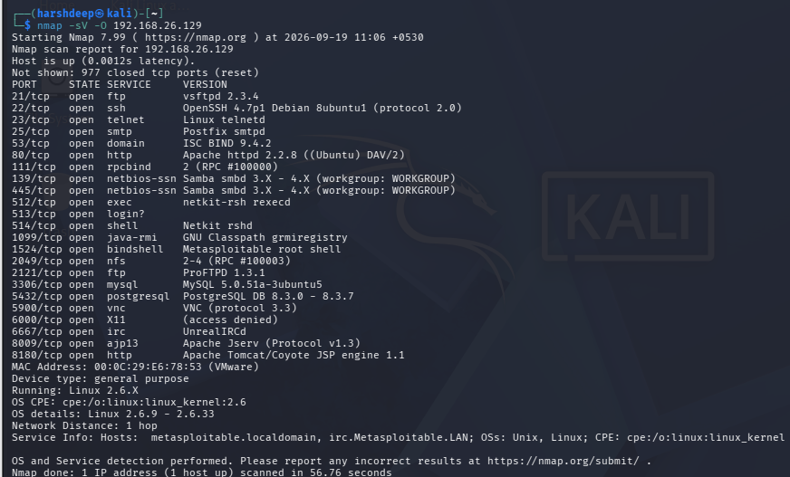
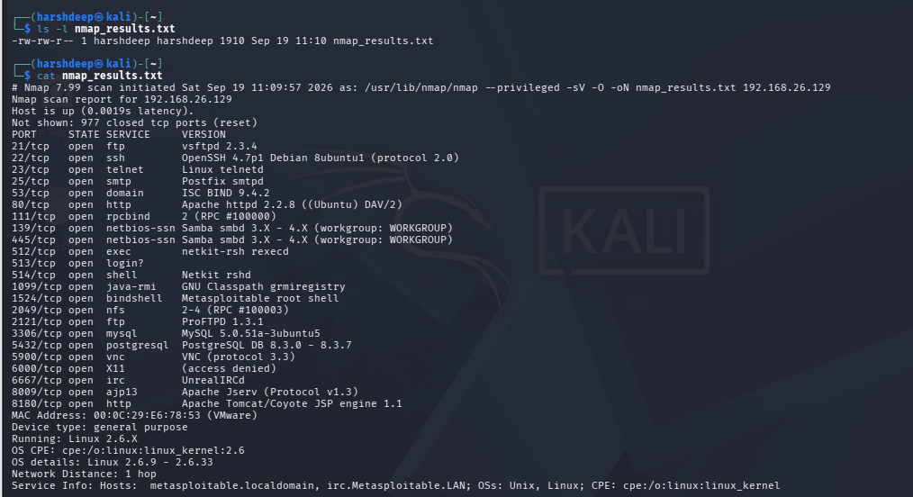
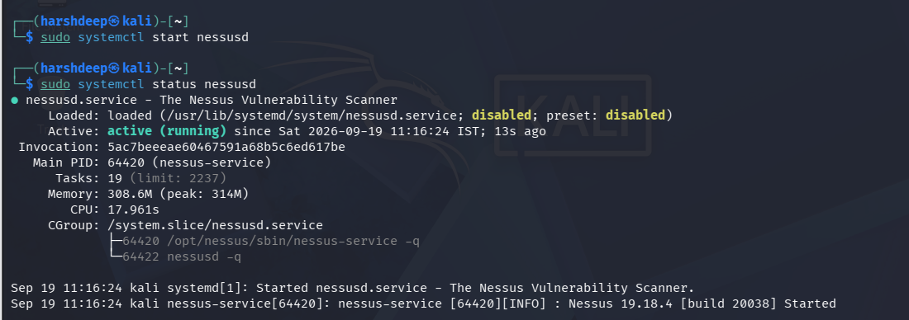
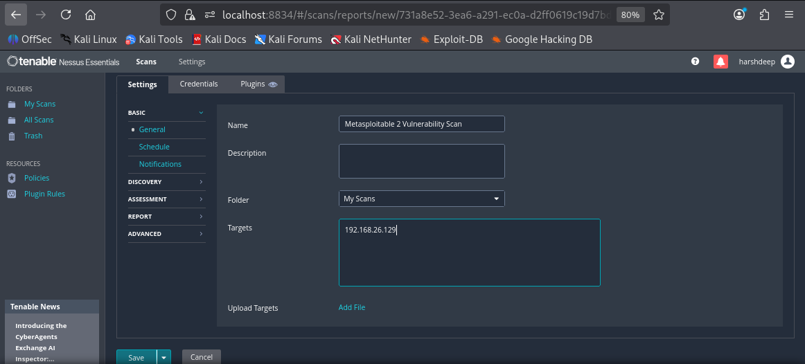
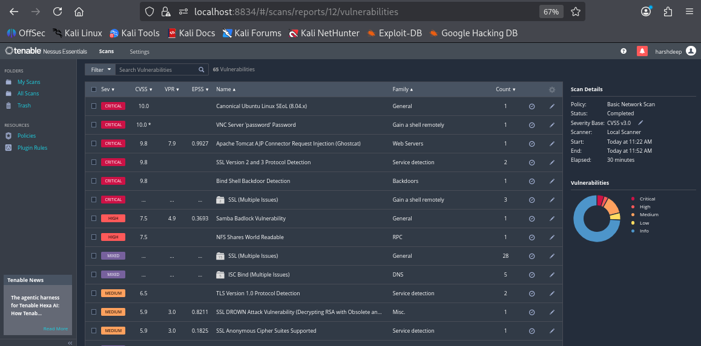
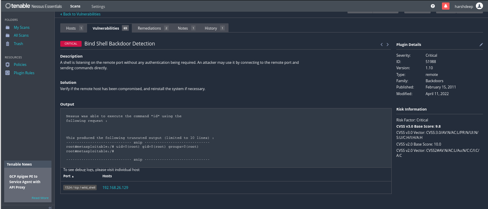

# Experiment 1: Scanning for Vulnerabilities in a Network Using Nmap and Nessus

## Aim

To scan a vulnerable network system using Nmap and Nessus, identify active hosts, open ports, running services, service versions, operating system information, and security vulnerabilities.

---

## Objective

1. To identify the IP addresses of the Kali Linux and Metasploitable machines.
2. To discover active hosts on the network using Nmap.
3. To identify open TCP ports and running services using a TCP SYN scan.
4. To identify service versions and the operating system of the target.
5. To save and verify Nmap scan results.
6. To perform vulnerability scanning using Nessus.
7. To identify and examine security vulnerabilities in the target system.

---

## Tools and Technologies Used

- Kali Linux
- Metasploitable 2
- Nmap
- Nessus
- VMware

---

# Procedure

## Step 1: Identify Kali Linux IP Address and Check Connectivity

The IP address of the Kali Linux machine was identified using the `ip addr` command.

The Kali Linux machine used the following IP address on the laboratory network:

```text
192.168.26.130
```

The connectivity with the Metasploitable machine was checked using the following command:

```bash
ping -c 4 192.168.26.129
```

The ping was successful with **0% packet loss**, confirming that Kali Linux could communicate with the Metasploitable machine.

### Output



---

## Step 2: Discover Live Hosts on the Network

The `nmap -sn` command was used to discover active hosts on the laboratory network.

```bash
nmap -sn 192.168.26.0/24
```

The scan identified the active hosts on the network. The Metasploitable target was identified as:

```text
192.168.26.129
```

The Kali Linux machine was:

```text
192.168.26.130
```

### Output



---

## Step 3: Perform TCP SYN Scan

A TCP SYN scan was performed against the Metasploitable machine to identify open TCP ports.

```bash
nmap -sS 192.168.26.129
```

The scan identified multiple open TCP ports on the target system, including ports associated with FTP, SSH, Telnet, HTTP, SMB, MySQL, PostgreSQL, VNC and other services.

### Output



---

## Step 4: Perform Service Version and Operating System Detection

Nmap was used to identify the versions of running services and operating system information.

```bash
nmap -sV -O 192.168.26.129
```

The scan detected several services and their versions, including:

- FTP - vsftpd 2.3.4
- SSH - OpenSSH 4.7p1
- Telnet
- SMTP - Postfix
- DNS - ISC BIND
- HTTP - Apache
- Samba
- MySQL
- PostgreSQL
- VNC
- Apache Tomcat

The operating system was identified as a Linux-based system using the Linux 2.6.x kernel.

### Output



---

## Step 5: Save and Verify Nmap Scan Results

The Nmap scan results were saved into a text file using the `-oN` option.

```bash
nmap -sV -O 192.168.26.129 -oN nmap_results.txt
```

The existence of the file was verified using:

```bash
ls -l nmap_results.txt
```

The saved results were then displayed using:

```bash
cat nmap_results.txt
```

The file was successfully created and contained the Nmap scan results.

### Output



---

## Step 6: Start Nessus Vulnerability Scanner

The Nessus service was started using the following command:

```bash
sudo systemctl start nessusd
```

The status of the Nessus service was checked using:

```bash
sudo systemctl status nessusd
```

The Nessus service was successfully started and showed an **active (running)** status.

Nessus was accessed through the web browser using:

```text
https://localhost:8834
```

### Output



---

## Step 7: Configure Nessus Vulnerability Scan

A **Basic Network Scan** was created in Nessus.

The scan was configured with the following details:

**Scan Name:**

```text
Metasploitable 2 Vulnerability Scan
```

**Target:**

```text
192.168.26.129
```

The scan configuration was saved and the vulnerability scan was started.

### Output



---

## Step 8: Perform Vulnerability Scan

Nessus performed a vulnerability scan against the Metasploitable 2 target.

The completed scan identified a total of **65 vulnerabilities** across different severity categories, including Critical, High, Medium, Low and Informational findings.

### Output



---

## Step 9: Examine a Security Vulnerability

One of the findings examined during the Nessus scan was:

**Bind Shell Backdoor Detection**

The finding indicated that a shell was listening on a remote port without authentication.

Nessus was able to execute the following command on the target:

```text
id
```

The result was:

```text
uid=0(root) gid=0(root) groups=0(root)
```

This indicates that the command was executed with root-level privileges on the target system.

### Output



---

# Result

The experiment successfully demonstrated network scanning and vulnerability assessment using Nmap and Nessus.

Nmap was used to:

- Discover active hosts.
- Identify open TCP ports.
- Detect running services.
- Identify service versions.
- Detect operating system information.
- Save scan results to a file.

Nessus was used to perform vulnerability assessment of the Metasploitable 2 machine and identified **65 vulnerabilities**.

---

# Solution

The identified vulnerabilities should be addressed by:

1. Removing or disabling unnecessary services.
2. Updating vulnerable software and services.
3. Using secure versions of network services.
4. Restricting access to sensitive services using firewall rules.
5. Removing unauthorized backdoors or shells.
6. Investigating the system if unauthorized access is suspected.
7. Reinstalling or rebuilding a compromised system when required.

Since Metasploitable 2 is intentionally designed as a vulnerable machine for security training, the vulnerabilities observed in this experiment are expected.

---

# Conclusion

This experiment demonstrated the use of **Nmap** and **Nessus** for network scanning and vulnerability assessment.

Nmap was used to identify live hosts, open ports, services, service versions and operating system information. Nessus was then used to identify vulnerabilities present on the Metasploitable 2 system.

The experiment helped in understanding how security professionals perform network reconnaissance and vulnerability assessment in a controlled laboratory environment.

---

# Lab Environment

| Machine | IP Address | Purpose |
|---|---|---|
| Kali Linux | `192.168.26.130` | Security testing and scanning |
| Metasploitable 2 | `192.168.26.129` | Vulnerable target |
| Laboratory Network | `192.168.26.0/24` | Isolated lab network |

---

# Repository Structure

```text
EXPERIMENT 1/
│
├── README.md
│
└── output/
    ├── step1.png
    ├── step2.png
    ├── step3.png
    ├── step4.png
    ├── step5.png
    ├── step6.png
    ├── step7.png
    ├── step8.png
    └── step9.png
```
