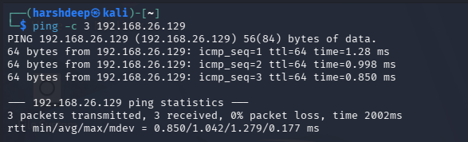
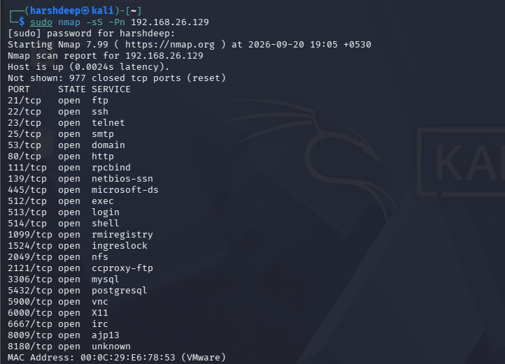
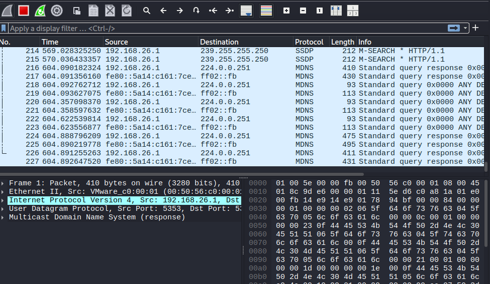
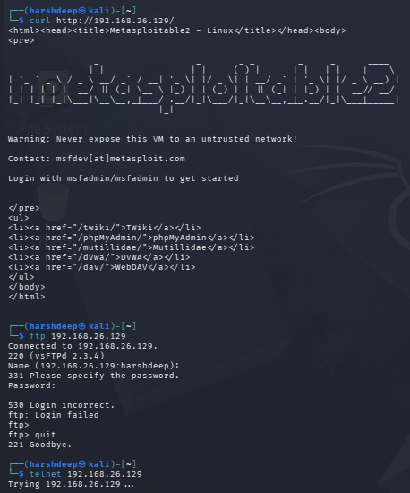
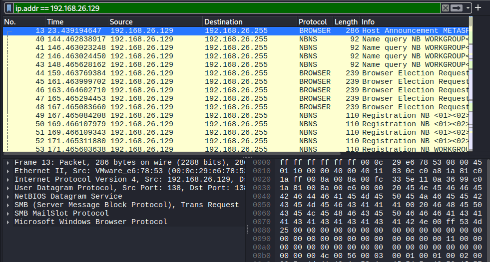
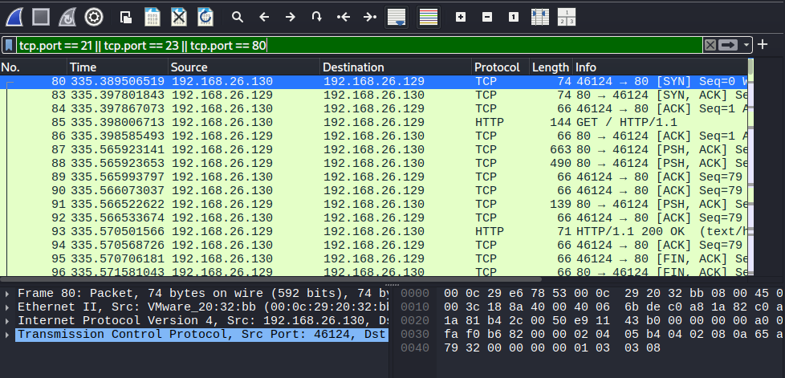
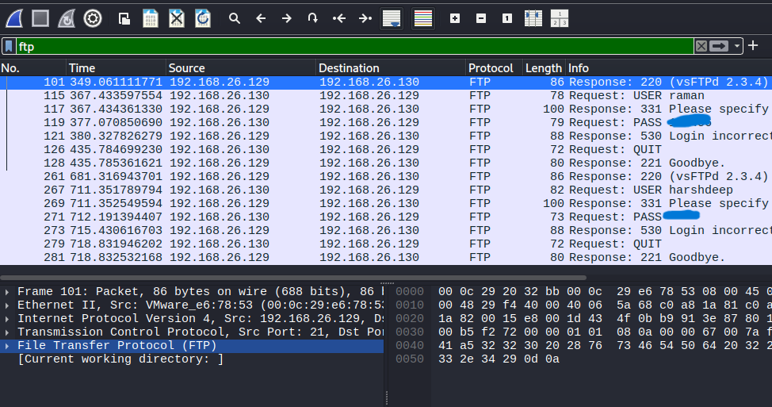
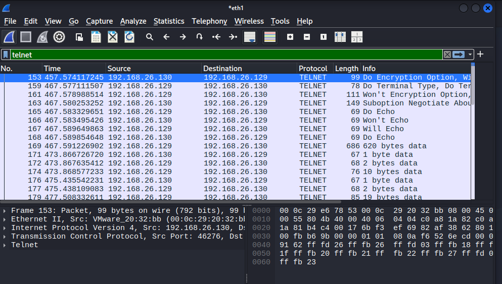
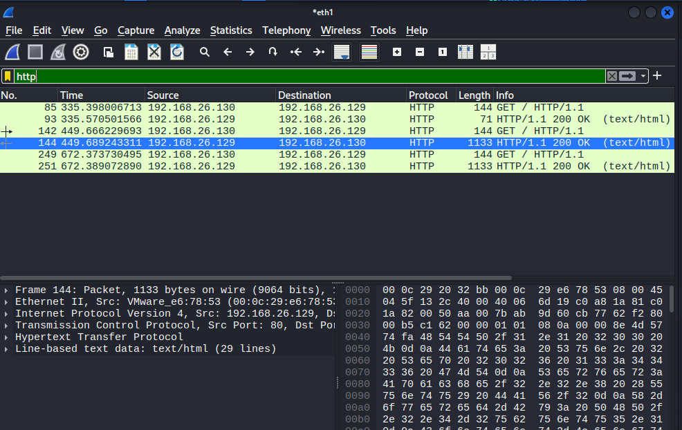
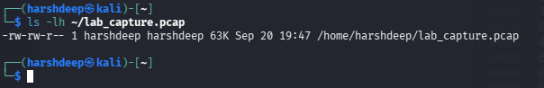

# Experiment 3: Basic Network Traffic Analysis with Wireshark

## Aim

To capture and analyze network traffic in a controlled laboratory environment using Wireshark and identify different types of network communication such as HTTP, FTP, and Telnet traffic.

---

## Objective

1. To establish connectivity between Kali Linux and Metasploitable 2.
2. To identify open ports and services using Nmap.
3. To capture network traffic using Wireshark.
4. To generate HTTP, FTP, and Telnet traffic in the laboratory environment.
5. To apply Wireshark display filters for analyzing captured packets.
6. To analyze FTP, Telnet, and HTTP traffic.
7. To save the captured network traffic for further analysis.

---

## Tools and Technologies Used

- Kali Linux
- Metasploitable 2
- Wireshark
- Nmap
- Curl
- FTP
- Telnet
- VMware
- TCP/IP

---

# Procedure

## Step 1: Verify Network Connectivity

The connectivity between Kali Linux and Metasploitable 2 was verified using the following command:

```bash
ping -c 3 192.168.26.129
```

The ping was successful, confirming that the target machine was reachable.

### Output



---

## Step 2: Perform Nmap Scan

An Nmap SYN scan was performed to identify open ports and services running on Metasploitable 2.

```bash
sudo nmap -sS -Pn 192.168.26.129
```

The scan identified open services including FTP on port 21, Telnet on port 23, and HTTP on port 80.

### Output



---

## Step 3: Start Wireshark and Capture Traffic

Wireshark was opened on Kali Linux and the `eth1` network interface was selected.

The packet capture was started before generating network traffic.

### Output



---

## Step 4: Generate Network Traffic

HTTP, FTP, and Telnet traffic was generated from Kali Linux while Wireshark was capturing packets.

### HTTP Traffic

```bash
curl http://192.168.26.129/
```

### FTP Traffic

```bash
ftp 192.168.26.129
```

### Telnet Traffic

```bash
telnet 192.168.26.129
```

### Output



---

## Step 5: Analyze Captured Traffic

The captured packets were analyzed using Wireshark display filters.

### Step 5.1: Filter Traffic by IP Address

The following filter was applied:

```text
ip.addr == 192.168.26.129
```

### Output



---

### Step 5.2: Filter Traffic by TCP Port

The following filter was applied:

```text
tcp.port == 21 || tcp.port == 23 || tcp.port == 80
```

### Output



---

### Step 5.3: Analyze FTP Traffic

The following filter was applied:

```text
ftp
```

The FTP packets were captured and analyzed.

### Output



---

### Step 5.4: Analyze Telnet Traffic

The following filter was applied:

```text
telnet
```

The Telnet packets were captured and analyzed.

### Output



---

### Step 5.5: Analyze HTTP Traffic

The following filter was applied:

```text
http
```

The HTTP packets were captured and analyzed.

### Output



---

## Step 6: Save the Network Capture

The captured network traffic was saved as a Wireshark capture file.

The original capture was saved as:

```text
lab_capture.pcapng
```

The capture was converted to PCAP format using:

```bash
editcap -F pcap ~/lab_capture.pcapng ~/lab_capture.pcap
```

The generated PCAP file was verified using:

```bash
ls -lh ~/lab_capture.pcap
```

The final PCAP file was successfully created.

### Output



---

# Result

The network traffic analysis experiment was successfully completed. Network connectivity was verified, open services were identified using Nmap, and HTTP, FTP, and Telnet traffic was captured and analyzed using Wireshark. The captured traffic was successfully saved in PCAP format.

---

# Security Observation

The experiment demonstrated that network traffic generated by protocols such as FTP and Telnet can be inspected using packet-analysis tools such as Wireshark. This highlights the importance of using secure and encrypted communication protocols in real-world networks.

---

# Solution

The following security measures can be used to reduce the risks associated with unencrypted network communication:

- Use SSH instead of Telnet.
- Use SFTP or FTPS instead of traditional FTP.
- Use encrypted communication protocols wherever possible.
- Restrict unnecessary network services.
- Use firewalls to control access to network services.
- Monitor network traffic for suspicious activity.
- Regularly update and secure network services.

---

# Conclusion

This experiment provided practical experience in capturing and analyzing network traffic using Wireshark. Nmap was used to identify available network services, while Wireshark was used to capture and filter HTTP, FTP, and Telnet traffic. The experiment demonstrated how packet-analysis tools can be used to understand network communication and identify security concerns associated with unencrypted protocols.

---

# Lab Environment

| Machine | IP Address | Purpose |
|---|---|---|
| Kali Linux | 192.168.26.130 | Traffic generation and packet analysis |
| Metasploitable 2 | 192.168.26.129 | Target laboratory machine |
| Laboratory Network | 192.168.26.0/24 | Isolated laboratory network |
| Capture Interface | eth1 | Network traffic capture |

---

# Repository Structure

```text
EXPERIMENT 3/
│
├── README.md
│
└── output/
    ├── step1.png
    ├── step2.png
    ├── step3.png
    ├── step4.png
    ├── step5_ip.addr.png
    ├── step5_tcp.port.png
    ├── step5_ftp.png
    ├── step5_telnet.png
    ├── step5_http.png
    └── step6.png
```
